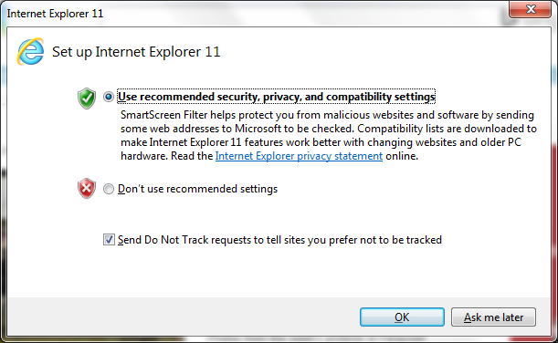

# Система компьютерного зрения для анализа урожайности посевов пшеницы

Работа была выполнена в рамках практики на ФИТ НГУ и проходила в ИЦиГ СО РАН.


## Установка

На Linux

<details><summary> <b>Раскрыть:</b> </summary>

Сохраните файл [src/deploy_wds_on_ubuntu_20.04.sh](src/deploy_wds_on_ubuntu_20.04.sh) и запустите команду

```
sh src/deploy_wds_on_ubuntu_20.04.sh
```

</details>


На Windows

<details><summary> <b>Раскрыть:</b> </summary>

Сохраните файл [src/deploy_wds_on_windows_10.ps1](src/deploy_wds_on_windows_10.ps1) и запустите команду

```
./src/deploy_wds_on_windows_10.ps1
```

Если у вас заблокировано выполнение скриптов, выполните в powershell от имени администратора

```
Set-ExecutionPolicy unrestricted
```

Если вы не запускали Internet Explorer, то настройте его:



</details>


## Запуск

Для того, чтобы получить результат по отдельным делянкам, нужно:

1. Распределить снимки по папкам полей и дней съёмки внутри директории data

2. Выполнить команду ```python src/plot.py``` в тот, день когда видна структура делянок.

3. Разметить делянки при помощи карты в директории ```maps``` и сохранить полученный geojson-файл в директории поля.

4. Отредактировать geojson файл, подписав сорта и условия эксперимента. Можно использовать сервис https://geojson.io

5. Выполнить команду ```python src/main.py```. Получится карта и csv-файл с результатами


**Подробная инструкция:**

[Запуск на ubuntu 20.04](docs/Запуск%20на%20ubuntu%2020.04.pdf)


## Структура папок и назначение файлов

```
📂data
 ┗ 📂test_set1             поле
 ┃ ┗ 📂attempt             попытка или дата съёмки
 ┃ ┃ ┣ 📂src               исходные файлы
 ┃ ┃ ┣ 📂log
 ┃ ┃ ┃ ┣ 📜test_set1.07_25.frcnn.400.bboxes.csv       найденные колоски
 ┃ ┃ ┃ ┣ 📜test_set1.07_25.frcnn.400.metadata.csv     обработанные метаданные
 ┃ ┃ ┃ ┗ 📜test_set1.07_25.frcnn.400.result.csv       файл результатов (делянка - число колосьев)
 ┃ ┃ ┣ 📂mod               повернутые и сжатые для разметки делянок
 ┃ ┃ ┣ 📂tmp               результат работы exiftool
 ┃ ┗ 📜test_set1.geojson
```

<!-- field_name_year может содержать в конце номер сезона, если в году несколько урожаев.  -->

**Файл \*.geojson размечается вручную 1 раз за сезон.**


